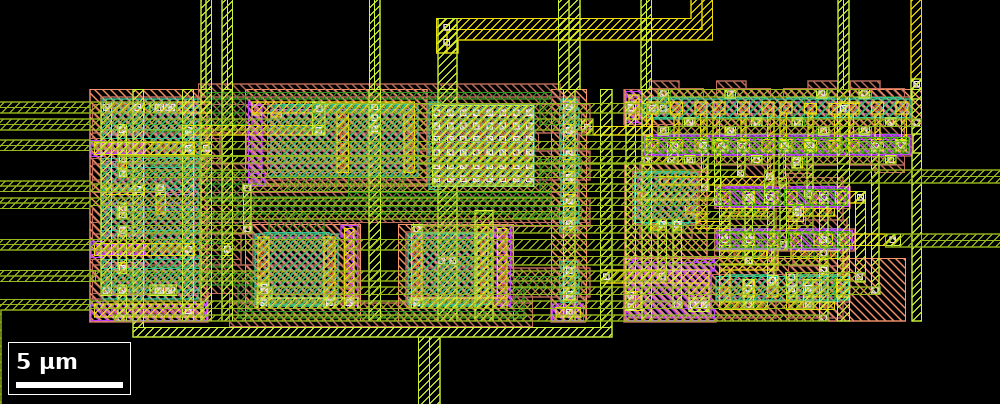
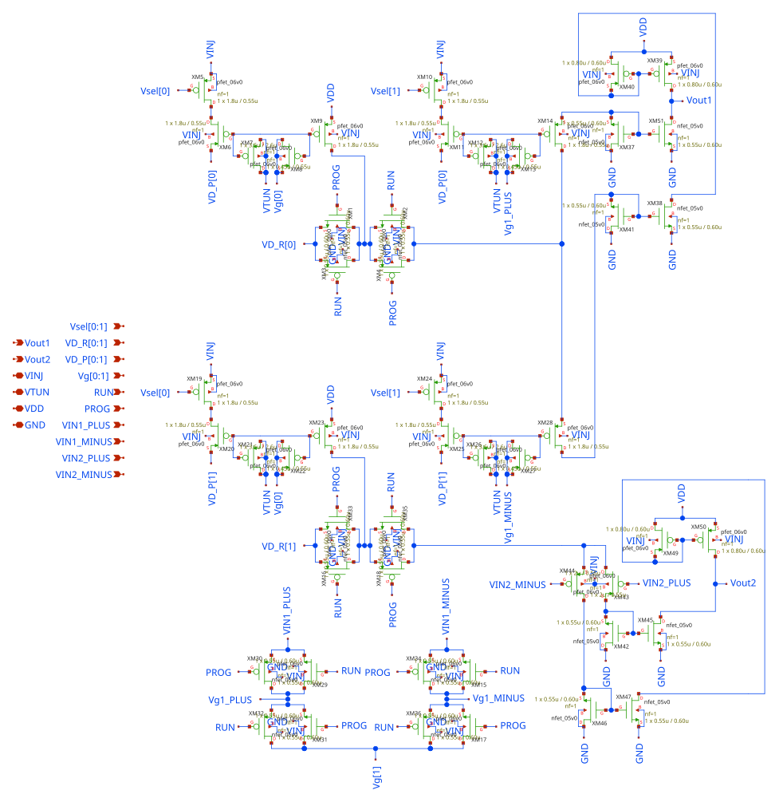

# Transconductance amplifiers

`gf180_2TA_1FG_Strong` contains two operational transconductance amplifiers
(OTAs) with floating-gate (FG) programming. An OTA converts a differential
input voltage into an output current. Floating gates allow parameters of such
an amplifier to be programmed after fabrication and retained without power
([Chawla et al., 2007](https://doi.org/10.1109/TCSI.2006.887473)). The
repository does not explain the cell name or describe the amplifier topology
beyond the schematic. The chip is described in the
[top-level&nbsp;README](../../../README.md).

## Overview

| Item | Value |
|---|---|
| Layout cell | `gf180_2TA_1FG_Strong` |
| Size (µm) | 39.1&nbsp;×&nbsp;12.0 |
| Origin in `chip_top` (µm) | 2984,&nbsp;1931 |
| Devices in the schematic | 34 `pfet_06v0`, 16 `nfet_05v0` |

*Figure 1. Layout of the cell as placed in `chip_top`.*

## Files

| File | Contents |
|---|---|
| [`gf180_2TA_1FG_Strong.sch`](gf180_2TA_1FG_Strong.sch) | [xschem](https://xschem.sourceforge.io/) schematic. |
| [`gf180_2TA_1FG_Strong.gds`](gf180_2TA_1FG_Strong.gds) | Layout. Matches the cell placed in `chip_top`. |
| [`gf180_2TA_1FG_Strong.lyrdb`](gf180_2TA_1FG_Strong.lyrdb) | [KLayout](https://www.klayout.de/) DRC report. |
| [`gf180_2TA_1FG_Strong.mag`](gf180_2TA_1FG_Strong.mag) | [Magic](http://opencircuitdesign.com/magic/) layout. |
| [`gf180_2TA_1FG_Strong_magic.gds`](gf180_2TA_1FG_Strong_magic.gds) | GDS written by Magic. Differs from the cell placed in `chip_top`. |

## Circuit

*Figure 2. Schematic, from
[`gf180_2TA_1FG_Strong.sch`](gf180_2TA_1FG_Strong.sch). Some device labels
overlap in the source file.*

| Group | Ports |
|---|---|
| Amplifier 1 | `VIN1_PLUS`, `VIN1_MINUS`, `Vout1` |
| Amplifier 2 | `VIN2_PLUS`, `VIN2_MINUS`, `Vout2` |
| Floating-gate programming | `VD_P[0:1]`, `VD_R[0:1]`, `Vg[0:1]`, `Vsel[0:1]`, `VINJ`, `VTUN` |
| Mode | `PROG`, `RUN` |
| Supply | `VDD`, `GND` |

- The programming ports have the same names and roles as in the
  [floating-gate array](../4x2_Indirect/README.md#circuit).
- `PROG` and `RUN` drive complementary switches that select between
  programming and normal operation.
- In `chip_top`, `RUN` is driven from the `PROG` pad through an `inv_4`
  standard cell, so `RUN` is the inverse of `PROG` and only `PROG` is bonded
  out.

## Pad assignment

| Port | Pad | Label in GDS | Shared with |
|---|---|---|---|
| `VIN1_MINUS` | [11](../../../docs/pad-map.md#bottom-side-left-to-right) | `bidir_PAD[6]` | [WTA](../../../2_Tools/lib/gds/README.md#pad-assignment) `Vin<0>` |
| `VIN1_PLUS` | [12](../../../docs/pad-map.md#bottom-side-left-to-right) | `bidir_PAD[7]` | [WTA](../../../2_Tools/lib/gds/README.md#pad-assignment) `Vin<1>` |
| `VIN2_PLUS` | [17](../../../docs/pad-map.md#bottom-side-left-to-right) | `bidir_PAD[12]` | [WTA](../../../2_Tools/lib/gds/README.md#pad-assignment) `Vin<2>` |
| `VIN2_MINUS` | [18](../../../docs/pad-map.md#bottom-side-left-to-right) | `bidir_PAD[13]` | [WTA](../../../2_Tools/lib/gds/README.md#pad-assignment) `Vin<3>` |
| `Vg[0]` | [27](../../../docs/pad-map.md#right-side-bottom-to-top) | `bidir_PAD[18]` | [FG char cell](../FGCharacterization/README.md#pad-assignment) `Vpoly` |
| `Vg[1]` | [30](../../../docs/pad-map.md#right-side-bottom-to-top) | `bidir_PAD[21]` | [FG char cell](../FGCharacterization/README.md#pad-assignment) `Vgate` |
| `Vout1` | [34](../../../docs/pad-map.md#right-side-bottom-to-top) | `bidir_PAD[25]` | |
| `Vout2` | [37](../../../docs/pad-map.md#top-side-right-to-left) | `bidir_PAD[26]` | |
| `PROG` | [38](../../../docs/pad-map.md#top-side-right-to-left) | `bidir_PAD[27]` | |
| `Vsel[1]` | [39](../../../docs/pad-map.md#top-side-right-to-left) | `bidir_PAD[28]` | |
| `Vsel[0]` | [40](../../../docs/pad-map.md#top-side-right-to-left) | `bidir_PAD[29]` | |
| `VTUN` | [46](../../../docs/pad-map.md#top-side-right-to-left) (bare) | `bidir_PAD[33]` | [FG array](../4x2_Indirect/README.md#pad-assignment) `VTUN`, [FG char cell](../FGCharacterization/README.md#pad-assignment) `VTUN` |
| `VD_P[0]` | [51](../../../docs/pad-map.md#top-side-right-to-left) | `bidir_PAD[38]` | [FG array](../4x2_Indirect/README.md#pad-assignment) `Vd_P[0]` |
| `VD_R[0]` | [52](../../../docs/pad-map.md#top-side-right-to-left) | `bidir_PAD[39]` | [FG array](../4x2_Indirect/README.md#pad-assignment) `Vd_R[0]` |
| `VD_R[1]` | [53](../../../docs/pad-map.md#top-side-right-to-left) | `bidir_PAD[40]` | [FG array](../4x2_Indirect/README.md#pad-assignment) `Vd_R[1]` |
| `VD_P[1]` | [54](../../../docs/pad-map.md#top-side-right-to-left) | `bidir_PAD[41]` | [FG array](../4x2_Indirect/README.md#pad-assignment) `Vd_P[1]` |
| `VDD` | [63](../../../docs/pad-map.md#left-side-top-to-bottom) | `analog_PAD[0]` | Core supply |
| `GND` | [5](../../../docs/pad-map.md#bottom-side-left-to-right), [19](../../../docs/pad-map.md#bottom-side-left-to-right), [25](../../../docs/pad-map.md#right-side-bottom-to-top), [35](../../../docs/pad-map.md#right-side-bottom-to-top), [42](../../../docs/pad-map.md#top-side-right-to-left), [56](../../../docs/pad-map.md#top-side-right-to-left), [62](../../../docs/pad-map.md#left-side-top-to-bottom), [72](../../../docs/pad-map.md#left-side-top-to-bottom) | `VSS` | Every cell |

`RUN` has no pad. `VINJ` has no pad either; see
[Known layout issues](#known-layout-issues).

## Known layout issues

`VINJ` does not reach a pad. In the
[netlist extracted from `chip_top`](../../../docs/updating-images.md#netlists-and-pad-map),
the `VINJ` net stays inside the cell. It is the n-well of most of the pFETs and
the source of the select pFETs, so those wells are not tied to a supply pad.
Pad 24 (`bidir_PAD[17]`), next to the `VINJ` pad of the FG char cell, has no
connection to any structure.

The effect on normal operation and on injection programming has not been
analyzed. The finding comes from layout extraction with the GF180MCU KLayout
LVS deck and has not been confirmed by the designers or on silicon.

## Measurement procedure

| Measurement | Method |
|---|---|
| Transfer characteristic | With `PROG` low, so that `RUN` is high, sweep the differential input of one amplifier about a common-mode voltage and measure the output current into a fixed voltage, or the output voltage into a known load. |
| Programmed response | Program the floating gates as for the [floating-gate array](../4x2_Indirect/README.md#measurement-procedure) and repeat the transfer characteristic. |
| Retention | Repeat the transfer characteristic after a power cycle. |

The amplifier inputs share pads with the WTA inputs, and `VTUN`, `VD_P` and
`VD_R` are shared with the FG array.

## Expected results

No expected values are recorded. The repository gives no target
transconductance, bias current or offset.

## Simulation

There is no testbench for this cell. The floating-gate nodes in
[`gf180_2TA_1FG_Strong.sch`](gf180_2TA_1FG_Strong.sch) have no DC path, so a
simulation requires an assumed voltage on each floating gate.

## References

- R. Chawla, F. Adil, G. Serrano, P. E. Hasler, "Programmable Gm-C Filters
  Using Floating-Gate Operational Transconductance Amplifiers," IEEE Trans.
  Circuits and Systems I, 2007.
  [doi:10.1109/TCSI.2006.887473](https://doi.org/10.1109/TCSI.2006.887473)
- V. Srinivasan, G. J. Serrano, J. Gray, P. Hasler, "A Precision CMOS Amplifier
  Using Floating-Gate Transistors for Offset Cancellation," IEEE Journal of
  Solid-State Circuits, 2007.
  [doi:10.1109/JSSC.2006.889365](https://doi.org/10.1109/JSSC.2006.889365)
- [Full list](../../../docs/references.md#floating-gate-transconductance-amplifiers)
