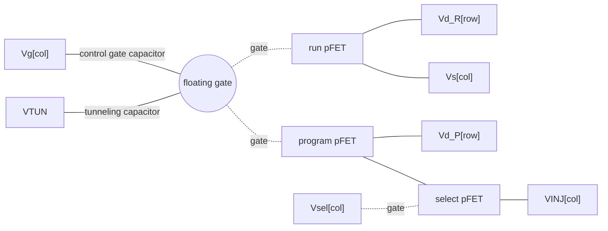

# Floating-gate array

`gf180_4x2_Indirect` is a 4×2 array of indirectly programmed floating-gate
pFETs. A floating gate stores charge with no connection to the outside, so each
cell holds an analog value without power. In an indirectly programmed cell, one
pFET is used to program the floating gate and a second pFET on the same
floating gate is used by the circuit, so the circuit never has to be
disconnected for programming.

For an overview of the chip see the [top-level README](../../../README.md).

## Floating-gate array

| Item | Value |
|---|---|
| Layout cell | `gf180_4x2_Indirect` |
| Size (µm) | 37.0&nbsp;×&nbsp;11.1 |
| Origin in `chip_top` (µm) | 1621,&nbsp;1966 |
| Array | 4 rows × 2 columns, 8 floating gates |
| Devices | 40 `pfet_06v0` |

### Files

| File | Contents |
|---|---|
| [`gf180_4x2_Indirect.gds`](gf180_4x2_Indirect.gds) | Layout. Matches the cell placed in `chip_top`. |
| [`gf180_4x2_Indirect.lyrdb`](gf180_4x2_Indirect.lyrdb) | KLayout DRC report for that layout. |
| [`gf180_4x2_Indirect.mag`](gf180_4x2_Indirect.mag) | Magic layout. |
| [`gf180_4x2_Indirect_magic.gds`](gf180_4x2_Indirect_magic.gds) | GDS written by Magic. Differs from the cell placed in `chip_top`. |
| [`gf180_4x2_Indirect_magic.lyrdb`](gf180_4x2_Indirect_magic.lyrdb) | KLayout DRC report for the Magic GDS. |

There is no schematic for this cell in the repository. A copy of the Magic
layout for new team members to study is in
[`3_Examples/Understanding_4x2_Indirect/`](../../../3_Examples/Understanding_4x2_Indirect).

### Circuit

Each of the eight cells has one floating gate and five devices. Sizes come
from layout extraction of the chip.

| Device | W / L (µm) | Connection |
|---|---|---|
| Control gate capacitor | 7.35 / 1.65 | pFET used as a capacitor between `Vg[col]` and the floating gate. |
| Tunneling capacitor | 0.45 / 0.55 | pFET used as a capacitor between `VTUN` and the floating gate. |
| Run pFET | 1.8 / 0.55 | Gate on the floating gate. Source and drain on `Vs[col]` and `Vd_R[row]`. |
| Program pFET | 1.8 / 0.55 | Gate on the floating gate. Drain on `Vd_P[row]`, source on the select pFET. |
| Select pFET | 1.8 / 0.55 | Gate on `Vsel[col]`. Connects the program pFET source to `VINJ[col]`. |

`VINJ[col]` is also the n-well of the run, program and select pFETs of that
column.

### Bonding

Pads 43 to 60 are on the top side of the die.

| Port | Pad | Label in GDS | Shared with |
|---|---|---|---|
| `Vs[1]` | 43 | `bidir_PAD[30]` | |
| `Vsel[1]` | 44 | `bidir_PAD[31]` | |
| `Vg[1]` | 45 | `bidir_PAD[32]` | |
| `VTUN` | 46 (bare) | `bidir_PAD[33]` | OTA `VTUN`, FG char `VTUN` |
| `Vg[0]` | 47 | `bidir_PAD[34]` | |
| `Vsel[0]` | 48 | `bidir_PAD[35]` | |
| `VINJ[0]`, `VINJ[1]` | 49 | `bidir_PAD[36]` | |
| `Vs[0]` | 50 | `bidir_PAD[37]` | |
| `Vd_P[0]` | 51 | `bidir_PAD[38]` | OTA `VD_P[0]` |
| `Vd_R[0]` | 52 | `bidir_PAD[39]` | OTA `VD_R[0]` |
| `Vd_R[1]` | 53 | `bidir_PAD[40]` | OTA `VD_R[1]` |
| `Vd_P[1]` | 54 | `bidir_PAD[41]` | OTA `VD_P[1]` |
| `Vd_P[2]` | 57 | `bidir_PAD[42]` | |
| `Vd_R[2]` | 58 | `bidir_PAD[43]` | |
| `Vd_R[3]` | 59 | `bidir_PAD[44]` | |
| `Vd_P[3]` | 60 | `bidir_PAD[45]` | |

Both columns share one `VINJ` pad. The array has no ground or `VDD` port.

### How to test

The measurements this structure is built for, following Graham et al. (2007):

| Measurement | Method |
|---|---|
| Read a cell | Hold `Vsel[col]` high so the select pFET is off. Bias `Vs[col]` and `Vd_R[row]`, then sweep `Vg[col]` and record the run pFET current. The curve shifts with the stored charge. |
| Tunnel (erase) | Raise `VTUN` in pulses. Tunneling removes electrons from every floating gate on the `VTUN` line and lowers the current of each pFET. |
| Inject (program) | Select the column with `Vsel[col]` low, raise `VINJ` so the program pFET has a large source-to-drain voltage, and pulse `Vd_P[row]` low. Injection adds electrons and raises the current of the pFETs in that cell. |
| Isolation | Program one cell and check that the read curves of the other seven do not move. |

Things to check first:

- `VTUN` is shared with the OTA and the FG char cell, so tunneling changes the
  floating gates in all three structures.
- Rows 0 and 1 share their `Vd_P` and `Vd_R` pads with the OTA.
- `VINJ` is on a standard analog pad, which may clamp near the pad ring supply.
  See [`docs/pad-map.md`](../../../docs/pad-map.md#things-to-know-before-probing-or-bonding).

### Expected results

The repository does not record programming voltages, pulse lengths or target
currents for this process, and there is no testbench for this cell. A SPICE
simulation with the open GF180MCU models does not move charge onto the
floating gate, so it can only give the read curve for an assumed charge.

## References

See [`docs/references.md`](../../../docs/references.md#indirectly-programmed-floating-gate-array).
Start with Graham, Farquhar, Degnan, Gordon and Hasler, "Indirect Programming of
Floating-Gate Transistors" (2007).
