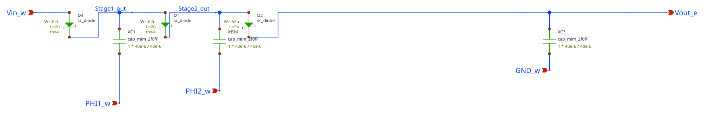

# Injection charge pump (design files)

Schematic, netlist, an earlier layout and the LVS runs for the injection charge
pump, a two-stage Dickson charge pump with Schottky diodes.

The layout that is on the chip is
[`2_Tools/lib/gds/FinalPumps/InjectionSchottkyPump.gds`](../../../2_Tools/lib/gds/FinalPumps/InjectionSchottkyPump.gds).
Pads, measurement steps and expected results for all three pumps are in the
[FinalPumps README](../../../2_Tools/lib/gds/FinalPumps/README.md).

## Injection charge pump

| File | Contents |
|---|---|
| [`InjectionSchottkyPump.sch`](InjectionSchottkyPump.sch) | xschem schematic. |
| [`InjectionSchottkyPump.spice`](InjectionSchottkyPump.spice) | Netlist written by xschem. |
| [`InjectionSchottkyPump.gds`](InjectionSchottkyPump.gds) | Layout. This file differs from the cell placed in `chip_top`. |
| [`InjectionSchottkyPump.lyrdb`](InjectionSchottkyPump.lyrdb) | KLayout DRC report. |
| [`lvs_run_2026_07_13_22_18_48/`](lvs_run_2026_07_13_22_18_48) to [`lvs_run_2026_07_14_15_38_03/`](lvs_run_2026_07_14_15_38_03) | Seven KLayout LVS runs, each with the extracted netlist, the LVS database and the log. |

Schematic values:

| Device | Schematic | Extracted from the final layout |
|---|---|---|
| Diodes `D4`, `D1`, `D2` | `sc_diode`, 0.62 µm × 2 µm, `m=4` | Five diodes in parallel, each 0.72 µm² |
| Capacitors `C1`, `C2`, `C3` | `cap_mim_2f0fF`, 40 µm × 40 µm | 40 µm × 40 µm, 3.2 pF |

The LVS runs in this directory extracted the three capacitors but no diodes.
An extraction with the current PDK deck finds the diodes as well. The result is
in [`docs/netlists/InjectionSchottkyPump.cir`](../../../docs/netlists/InjectionSchottkyPump.cir).

[`InjectionSchottkyPump.spice`](InjectionSchottkyPump.spice) records an absolute
path from the original author's machine in its header.

## Simulating

The ngspice testbench in [`docs/sim/`](../../../docs/sim/README.md) uses the
extracted netlist and the chip's clock path. At `VDD` = `Vin_w` = 5 V and a
10 MHz clock it gives 14.2 V unloaded.

## References

See [`docs/references.md`](../../../docs/references.md#charge-pumps).
