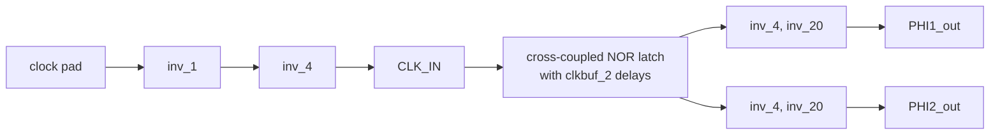
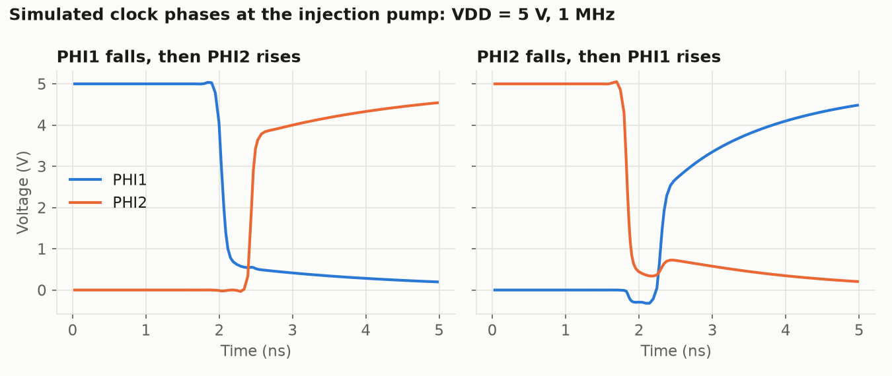

# Non-overlapping clock generator

`NonOvCLKGen` turns one clock into two phases, `PHI1_out` and `PHI2_out`, that
are never high at the same time. Each charge pump on the chip has its own copy,
which drives the pump capacitors.

Pads, measurement steps and expected results for the pumps are in the
[FinalPumps README](../../../2_Tools/lib/gds/FinalPumps/README.md).

## Clock generator

| Item | Value |
|---|---|
| Layout cell | `NonOvCLKGen` |
| Size (µm) | 47.1&nbsp;×&nbsp;8.7 |
| Origins in `chip_top` (µm) | 720,&nbsp;992 (injection pump), 720,&nbsp;1397 (HV pump), 720,&nbsp;1563 (tunneling pump) |
| Ports | `CLK_IN`, `PHI1_out`, `PHI2_out`, `VDD`, `GND` |
| Standard cells | `gf180mcu_fd_sc_mcu7t5v0`: 1 `clkinv_1`, 2 `nor2_1`, 4 `clkbuf_2`, 2 `inv_4`, 2 `inv_20`, 2 `filltie` |

The circuit is a cross-coupled NOR latch. Each NOR output passes through two
clock buffers before it feeds back to the other NOR gate, which sets the gap
between the phases. An `inv_4` and an `inv_20` then drive each pump phase.

The `inv_1` and `inv_4` pad buffer sits in `chip_top`, next to each clock
generator. The pad-to-phase path does not invert.

### Files

| File | Contents |
|---|---|
| [`NonOvCLKGen.gds`](NonOvCLKGen.gds) | Layout. Matches the cell placed in `chip_top`. |
| [`NonOvCLKGen.lyrdb`](NonOvCLKGen.lyrdb), [`DRC/NonOvCLKGen.lyrdb`](DRC/NonOvCLKGen.lyrdb) | KLayout DRC reports. |
| [`NonOvCLKGen.spice`](NonOvCLKGen.spice) | Netlist that includes the standard cell subcircuits. |
| [`design/NonOvCLKGen.sch`](design/NonOvCLKGen.sch) | xschem file that holds the circuit as a SPICE subcircuit. |
| [`design/NonOvCLKGen.sym`](design/NonOvCLKGen.sym) | xschem symbol. |
| [`design/NonOvCLKGen.mag`](design/NonOvCLKGen.mag) | Magic layout. |
| [`design/NonOvCLKGen_TB.sch`](design/NonOvCLKGen_TB.sch) | xschem and ngspice testbench: 5 V supply, 50 MHz input. |
| [`design/NonOvCLKGen_xschem.spice`](design/NonOvCLKGen_xschem.spice) | Netlist written by xschem. |
| [`LVS/`](LVS) | KLayout LVS runs with the extracted netlist [`LVS/NonOvCLKGen.cir`](LVS/NonOvCLKGen.cir). |

Several of these files contain absolute paths from the original author's
machine. See [`docs/repository.md`](../../../docs/repository.md#design-flow).

### Bonding

| Signal | Pad | Label in GDS |
|---|---|---|
| Injection pump clock | 69 | `input_PAD[2]` |
| HV pump clock | 66 | `analog_PAD[3]` |
| Tunneling pump clock | 65 | `analog_PAD[2]` |
| `VDD` | 63 | `analog_PAD[0]` |
| `GND` | 5, 19, 25, 35, 42, 56, 62, 72 | `VSS` |

`PHI1_out` and `PHI2_out` connect only to the pump next to each generator and
do not reach a pad, so the phases cannot be probed directly.

### Expected results

Simulated at `VDD` = 5 V with a 1 MHz clock and the injection pump as load,
measured at 2.5 V:

| Transition | Gap (ns) |
|---|---|
| `PHI1` falls, then `PHI2` rises | 0.41 |
| `PHI2` falls, then `PHI1` rises | 0.58 |

On silicon the generator can only be checked through the pump it drives: the
pump output rises when the clock runs.

### Simulating

[`docs/sim/tb_clkgen.spice`](../../../docs/sim/tb_clkgen.spice) is the testbench
for the numbers above. See [`docs/sim/README.md`](../../../docs/sim/README.md).

## References

See [`docs/references.md`](../../../docs/references.md#charge-pumps).
