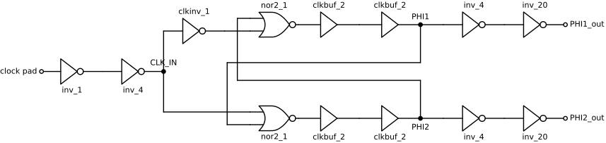

# Non-overlapping clock generator

`NonOvCLKGen` converts a single clock into two phases, `PHI1_out` and
`PHI2_out`, that are never high at the same time. A Dickson charge pump needs
such phases to drive alternate stages. Each of the three
[charge pumps](../../../2_Tools/lib/gds/FinalPumps/README.md) on the chip has its own copy. The chip is described in
the [top-level&nbsp;README](../../../README.md).

## Overview

| Item | Value |
|---|---|
| Layout cell | `NonOvCLKGen` |
| Size (µm) | 47.1&nbsp;×&nbsp;8.7 |
| Origins in `chip_top` (µm) | 720,&nbsp;992 (injection pump) 720,&nbsp;1397 (HV pump) 720,&nbsp;1563 (tunneling pump) |
| Ports | `CLK_IN`, `PHI1_out`, `PHI2_out`, `VDD`, `GND` |
| Cell library | `gf180mcu_fd_sc_mcu7t5v0`, the 7-track 5 V standard cells of the [GF180MCU PDK](https://gf180mcu-pdk.readthedocs.io/) |

The generator is the small block at the left of each pump image in the
[FinalPumps&nbsp;README](../../../2_Tools/lib/gds/FinalPumps/README.md#overview).

## Files

| File | Contents |
|---|---|
| [`NonOvCLKGen.gds`](NonOvCLKGen.gds) | Layout. Matches the cell placed in `chip_top`. |
| [`NonOvCLKGen.lyrdb`](NonOvCLKGen.lyrdb), [`DRC/NonOvCLKGen.lyrdb`](DRC/NonOvCLKGen.lyrdb) | [KLayout](https://www.klayout.de/) DRC reports. |
| [`NonOvCLKGen.spice`](NonOvCLKGen.spice) | Netlist that includes the standard cell subcircuits. |
| [`design/NonOvCLKGen.sch`](design/NonOvCLKGen.sch) | [xschem](https://xschem.sourceforge.io/) file that holds the circuit as a SPICE subcircuit. |
| [`design/NonOvCLKGen.sym`](design/NonOvCLKGen.sym) | xschem symbol. |
| [`design/NonOvCLKGen.mag`](design/NonOvCLKGen.mag) | [Magic](http://opencircuitdesign.com/magic/) layout. |
| [`design/NonOvCLKGen_TB.sch`](design/NonOvCLKGen_TB.sch) | xschem and ngspice testbench of the generator alone: 5 V supply, 50 MHz input. |
| [`design/NonOvCLKGen_xschem.spice`](design/NonOvCLKGen_xschem.spice) | Netlist written by xschem. |
| [`LVS/`](LVS) | KLayout LVS runs with the extracted netlist [`LVS/NonOvCLKGen.cir`](LVS/NonOvCLKGen.cir). |

Several of these files contain absolute paths from the original author's
machine, listed in [`docs/repository.md`](../../../docs/repository.md#design-flow).

## Circuit

*Figure 1. Clock path of one pump, from
[`design/NonOvCLKGen.sch`](design/NonOvCLKGen.sch) and the chip netlist.
Lines that cross without a dot are not connected.*

| Stage | Cells | Function |
|---|---|---|
| Pad buffer | `inv_1`, `inv_4` | Placed in `chip_top` beside each generator. Buffers the clock pad onto `CLK_IN`. |
| Complement | `clkinv_1` | Generates the inverted clock for the upper NOR gate. |
| Latch | 2 `nor2_1` | Cross-coupled NOR gates. Each output can rise only after the other phase has fallen. |
| Delay | 4 `clkbuf_2` | Two buffers after each NOR gate. Their delay sets the non-overlap time. |
| Driver | 2 `inv_4`, 2 `inv_20` | Drive the pump capacitors. |

The cell also contains two `filltie` cells. `PHI1_out` is high while the clock
pad is high, and `PHI2_out` is high while it is low.

## Pad assignment

| Signal | Pad | Label in GDS |
|---|---|---|
| Injection pump clock | [69](../../../docs/pad-map.md#left-side-top-to-bottom) | `input_PAD[2]` |
| HV pump clock | [66](../../../docs/pad-map.md#left-side-top-to-bottom) | `analog_PAD[3]` |
| Tunneling pump clock | [65](../../../docs/pad-map.md#left-side-top-to-bottom) | `analog_PAD[2]` |
| `VDD` | [63](../../../docs/pad-map.md#left-side-top-to-bottom) | `analog_PAD[0]` |
| `GND` | [5](../../../docs/pad-map.md#bottom-side-left-to-right), [19](../../../docs/pad-map.md#bottom-side-left-to-right), [25](../../../docs/pad-map.md#right-side-bottom-to-top), [35](../../../docs/pad-map.md#right-side-bottom-to-top), [42](../../../docs/pad-map.md#top-side-right-to-left), [56](../../../docs/pad-map.md#top-side-right-to-left), [62](../../../docs/pad-map.md#left-side-top-to-bottom), [72](../../../docs/pad-map.md#left-side-top-to-bottom) | `VSS` |

`PHI1_out` and `PHI2_out` connect only to the adjacent pump and do not reach a
pad.

## Measurement procedure

The phases cannot be probed directly. The generator is verified through the
pump it drives: with a clock applied, the pump output rises as described in the
[FinalPumps&nbsp;README](../../../2_Tools/lib/gds/FinalPumps/README.md#measurement-procedure).

## Expected results

Simulated non-overlap time at `VDD` = 5 V with a 1 MHz clock and the injection
pump as load, measured at 2.5 V:

| Transition | Non-overlap time |
|---|---|
| `PHI1` falls, then `PHI2` rises | 0.41 ns |
| `PHI2` falls, then `PHI1` rises | 0.58 ns |

*Figure 2. Simulated clock phases around both transitions.*

## Simulation

[`docs/sim/tb_clkgen.spice`](../../../docs/sim/tb_clkgen.spice) is the testbench for
these values. It simulates the complete clock path with the pump as load,
whereas [`design/NonOvCLKGen_TB.sch`](design/NonOvCLKGen_TB.sch) simulates the
unloaded latch at 50 MHz. See [`docs/sim/README.md`](../../../docs/sim/README.md).

## References

- [Charge pump references](../../../docs/references.md#charge-pumps)
