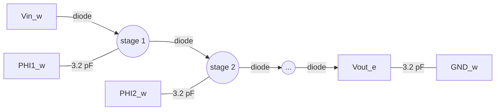

# Charge pumps (final layouts)

The three charge pump layouts that are placed in `chip_top`. Each is a Dickson
charge pump built from Schottky diodes and MIM capacitors, and each generates a
voltage above the supply from a two-phase clock. Floating-gate circuits need
such voltages for programming: hot-electron injection and Fowler-Nordheim
tunneling.

For an overview of the chip see the [top-level README](../../../../README.md).

| Pump | Layout cell | Stages | Size (µm) | Origin in `chip_top` (µm) | Output pad |
|---|---|---|---|---|---|
| [Injection](#injection-charge-pump) | `InjectionSchottkyPump` | 2 | 95.8&nbsp;×&nbsp;118.5 | 780,&nbsp;938 | 70 |
| [Tunneling](#tunneling-charge-pump) | `TunnelingSchottkyPump` | 3 | 95.8&nbsp;×&nbsp;118.5 | 780,&nbsp;1509 | 64 |
| [HV](#hv-charge-pump) | `HVSchottkyPump` | 4 | 150.0&nbsp;×&nbsp;118.5 | 780,&nbsp;1343 | 67 (bare) |

## Common design

Every stage is one Schottky diode cell and one 40 µm × 40 µm MIM capacitor
(about 3.2 pF). The capacitors of odd stages are driven by `PHI1_w` and those of
even stages by `PHI2_w`. A last diode feeds an output capacitor to `GND_w`.



Each diode cell holds five Schottky diodes in parallel, each 0.72 µm² in area
with a 4.72 µm perimeter. These values, and the stage counts, come from the
extracted netlists in [`docs/netlists/`](../../../../docs/netlists).

Each pump has its own clock generator, placed next to it in `chip_top`. See the
[clock generator README](../../../../1_Design/GF180_cells/NonOvCLKGen/README.md).

### Bonding

All three pumps share the input, supply and ground pads.

| Signal | Pad | Label in GDS | Notes |
|---|---|---|---|
| `Vin_w` of all three pumps | 68 | `input_PAD[1]` | Pump input voltage. |
| Clock generator `VDD` | 63 | `analog_PAD[0]` | Sets the clock amplitude. Shared with the other test structures. |
| `GND_w` | 5, 19, 25, 35, 42, 56, 62, 72 | `VSS` | Ground. |

The full pad list is in [`docs/pad-map.md`](../../../../docs/pad-map.md).

### How to measure

1. Connect ground and the pad ring supply.
2. Apply `VDD` to pad 63. The clock generator uses 5 V standard cells
   (`gf180mcu_fd_sc_mcu7t5v0`).
3. Apply the input voltage to pad 68.
4. Drive the clock pad of the pump under test with a square wave between 0 V and
   `VDD`. Hold the clock pads of the other two pumps at a fixed level.
5. Measure the output pad with a high-impedance instrument. The pump delivers
   only microamps: a 10 MΩ probe pulls the output down by 0.2 V to 2.6 V in
   simulation, depending on the pump and the clock frequency.

Check these before applying power:

- The injection and tunneling pump outputs are on standard analog pads, which
  contain diodes and may clamp the output near the pad ring supply. The HV pump
  output is on a bare pad. See
  [`docs/pad-map.md`](../../../../docs/pad-map.md#things-to-know-before-probing-or-bonding).
- The MIM capacitor model file states a 6 V limit across the capacitor, and the
  `sc_diode` model has a 17 V reverse breakdown. The simulated outputs at
  `VDD` = 5 V put more than 6 V across the later capacitors.

### Expected results

Simulated output voltage with `Vin_w` = `VDD`, typical corner, 10 pF on the
output. The testbenches and the full table are in
[`docs/sim/`](../../../../docs/sim/README.md#charge-pumps).

| Pump | VDD (V) | Clock (MHz) | Output, no load (V) | Output, 10 MΩ load (V) |
|---|---|---|---|---|
| Injection | 3.3 | 10 | 9.20 | 8.96 |
| Injection | 5.0 | 10 | 14.24 | 13.98 |
| Tunneling | 3.3 | 10 | 12.20 | 11.88 |
| Tunneling | 5.0 | 10 | 18.91 | 18.56 |
| HV | 3.3 | 10 | 15.19 | 14.79 |
| HV | 5.0 | 10 | 23.57 | 23.11 |


The pumps have not been measured on silicon yet.

## Injection charge pump

| Item | Value |
|---|---|
| Layout | [`InjectionSchottkyPump.gds`](InjectionSchottkyPump.gds) |
| DRC report | [`InjectionSchottkyPump.lyrdb`](InjectionSchottkyPump.lyrdb) |
| Extracted netlist | [`InjectionSchottkyPump.cir`](../../../../docs/netlists/InjectionSchottkyPump.cir) |
| Schematic and LVS runs | [`1_Design/GF180_cells/InjectionSchottyPump/`](../../../../1_Design/GF180_cells/InjectionSchottyPump/README.md) |
| Ports | `Vin_w`, `PHI1_w`, `PHI2_w`, `GND_w`, `Stage1_out`, `Stage2_out`, `Vout_e` |
| Devices | 3 diode cells, 3 MIM capacitors |
| Clock pad | 69 (`input_PAD[2]`) |
| Output pad | 70 (`input_PAD[3]`), analog pad |

`Stage1_out` and `Stage2_out` are labelled in the layout but do not reach a pad.


## Tunneling charge pump

| Item | Value |
|---|---|
| Layout | [`TunnelingSchottkyPump.gds`](TunnelingSchottkyPump.gds) |
| DRC report | [`TunnelingSchottkyPump.lyrdb`](TunnelingSchottkyPump.lyrdb) |
| Extracted netlist | [`TunnelingSchottkyPump.cir`](../../../../docs/netlists/TunnelingSchottkyPump.cir) |
| Ports | `Vin_w`, `PHI1_w`, `PHI2_w`, `GND_w`, `Vout_e` |
| Devices | 4 diode cells, 4 MIM capacitors |
| Clock pad | 65 (`analog_PAD[2]`) |
| Output pad | 64 (`analog_PAD[1]`), analog pad |

There is no schematic for this pump in the repository.


## HV charge pump

| Item | Value |
|---|---|
| Layout | [`HVSchottkyPump.gds`](HVSchottkyPump.gds) |
| DRC report | [`HVSchottkyPump.lyrdb`](HVSchottkyPump.lyrdb) |
| Extracted netlist | [`HVSchottkyPump.cir`](../../../../docs/netlists/HVSchottkyPump.cir) |
| Ports | `Vin_w`, `PHI1_w`, `PHI2_w`, `GND_w`, `Vout_e` |
| Devices | 5 diode cells, 5 MIM capacitors |
| Clock pad | 66 (`analog_PAD[3]`) |
| Output pad | 67 (`input_PAD[0]`), bare pad |

There is no schematic for this pump in the repository.


## Simulating

```sh
ln -s /path/to/gf180mcu/gf180mcuD docs/sim/pdk
cd docs/sim
python3 run_sims.py
```

See [`docs/sim/README.md`](../../../../docs/sim/README.md) for the testbench
files and their assumptions.

## References

See [`docs/references.md`](../../../../docs/references.md#charge-pumps). Start
with Hooper, Kucic and Hasler (2005) for charge pumps that program floating
gates, and Dickson (1976) for the circuit.
