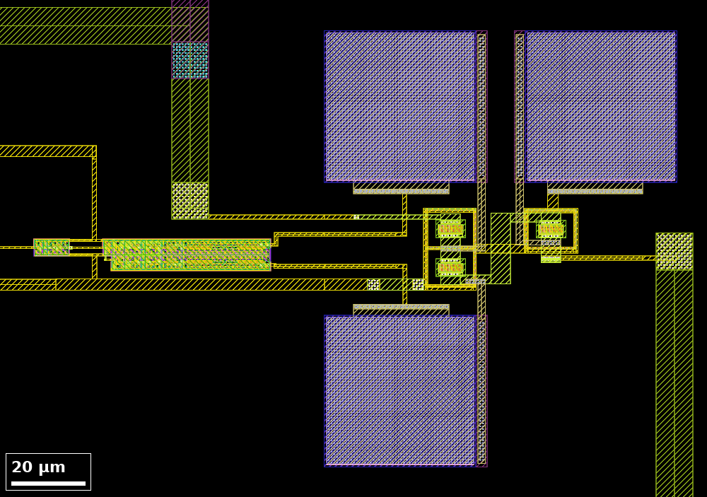
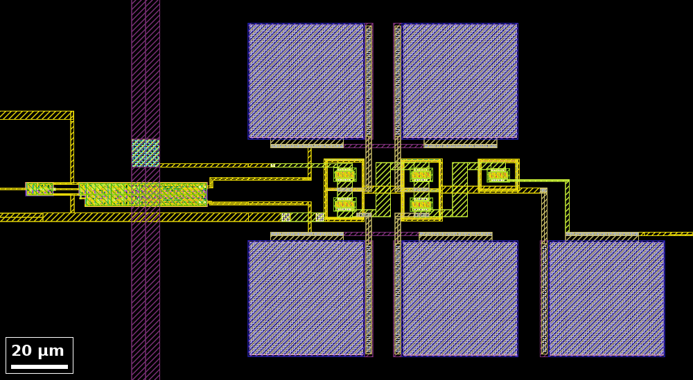
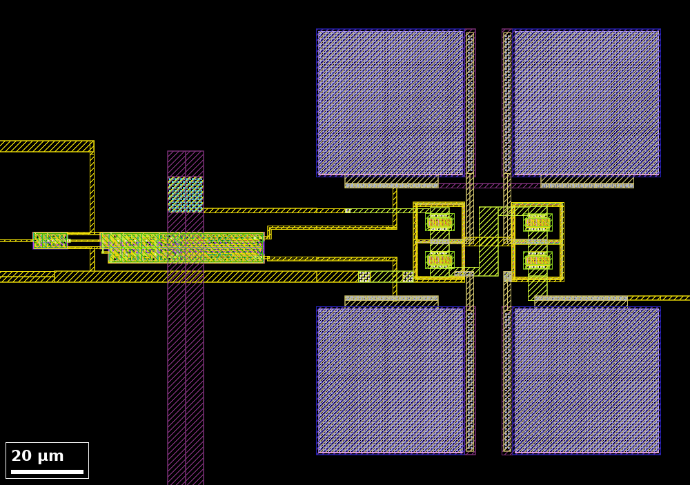
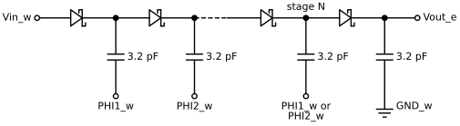
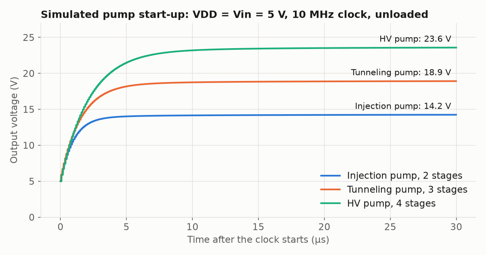

# Charge pumps

This directory holds the final layouts of the three charge pumps placed in
`chip_top`. Each is a Dickson charge pump
([Dickson, 1976](https://doi.org/10.1109/JSSC.1976.1050739)) built from
Schottky diodes and metal-insulator-metal (MIM) capacitors. A charge pump
generates a voltage above the supply from a two-phase clock; floating-gate (FG)
circuits require such voltages for hot-electron injection and Fowler-Nordheim
tunneling. The chip is described in the [top-level&nbsp;README](../../../../README.md).

## Overview

| Pump | Layout cell | Stages | Size (µm) | Origin in `chip_top` (µm) |
|---|---|---|---|---|
| Injection | `InjectionSchottkyPump` | 2 | 95.8&nbsp;×&nbsp;118.5 | 780,&nbsp;938 |
| HV (high voltage) | `HVSchottkyPump` | 4 | 150.0&nbsp;×&nbsp;118.5 | 780,&nbsp;1343 |
| Tunneling | `TunnelingSchottkyPump` | 3 | 95.8&nbsp;×&nbsp;118.5 | 780,&nbsp;1509 |

The repository does not record the intended use of the HV pump. The pump
outputs connect only to pads; no pump is wired to a floating-gate structure on
the chip.

<table>
  <tr>
    <td width="33%"> <em>Injection pump</em></td>
    <td width="33%"> <em>HV pump</em></td>
    <td width="33%"> <em>Tunneling pump</em></td>
  </tr>
</table>

*Figure 1. Layouts of the three pumps as placed in `chip_top`. The clock
generator is the small block at the left of each image and the squares are the
MIM capacitors.*

## Files

| Pump | Layout | DRC report | Extracted netlist |
|---|---|---|---|
| Injection | [`InjectionSchottkyPump.gds`](InjectionSchottkyPump.gds) | [`InjectionSchottkyPump.lyrdb`](InjectionSchottkyPump.lyrdb) | [`InjectionSchottkyPump.cir`](../../../../docs/netlists/InjectionSchottkyPump.cir) |
| HV | [`HVSchottkyPump.gds`](HVSchottkyPump.gds) | [`HVSchottkyPump.lyrdb`](HVSchottkyPump.lyrdb) | [`HVSchottkyPump.cir`](../../../../docs/netlists/HVSchottkyPump.cir) |
| Tunneling | [`TunnelingSchottkyPump.gds`](TunnelingSchottkyPump.gds) | [`TunnelingSchottkyPump.lyrdb`](TunnelingSchottkyPump.lyrdb) | [`TunnelingSchottkyPump.cir`](../../../../docs/netlists/TunnelingSchottkyPump.cir) |

The three layouts match the cells placed in `chip_top`. The schematic of the
injection pump is in the
[design&nbsp;files&nbsp;README](../../../../1_Design/GF180_cells/InjectionSchottyPump/README.md). The repository contains no schematic for
the HV or tunneling pump.

## Circuit

*Figure 2. Circuit of the pumps, from the extracted netlists. N is 2, 4 and 3
for the injection, HV and tunneling pumps.*

| Element | Value | Notes |
|---|---|---|
| Diode | Five `sc_diode` Schottky diodes in parallel, each 0.72 µm² in area with a 4.72 µm perimeter | One diode cell per stage and one at the output. |
| Pump capacitor | 40&nbsp;µm&nbsp;×&nbsp;40&nbsp;µm MIM, about 3.2 pF | Odd stages are driven by `PHI1_w`, even stages by `PHI2_w`. |
| Output capacitor | 40&nbsp;µm&nbsp;×&nbsp;40&nbsp;µm MIM, about 3.2 pF | Between `Vout_e` and `GND_w`. |

| Pump | Ports | Diode cells | MIM capacitors |
|---|---|---|---|
| Injection | `Vin_w`, `PHI1_w`, `PHI2_w`, `GND_w`, `Stage1_out`, `Stage2_out`, `Vout_e` | 3 | 3 |
| HV | `Vin_w`, `PHI1_w`, `PHI2_w`, `GND_w`, `Vout_e` | 5 | 5 |
| Tunneling | `Vin_w`, `PHI1_w`, `PHI2_w`, `GND_w`, `Vout_e` | 4 | 4 |

Each pump is driven by its own copy of the
[non-overlapping clock generator](../../../../1_Design/GF180_cells/NonOvCLKGen/README.md), placed beside it.

## Pad assignment

| Signal | Pad | Label in GDS | Notes |
|---|---|---|---|
| `Vin_w` of all three pumps | [68](../../../../docs/pad-map.md#left-side-top-to-bottom) | `input_PAD[1]` | Pump input voltage. |
| Clock generator `VDD` | [63](../../../../docs/pad-map.md#left-side-top-to-bottom) | `analog_PAD[0]` | Sets the clock amplitude. Shared with other structures. |
| Injection pump clock | [69](../../../../docs/pad-map.md#left-side-top-to-bottom) | `input_PAD[2]` | |
| Injection pump `Vout_e` | [70](../../../../docs/pad-map.md#left-side-top-to-bottom) | `input_PAD[3]` | Analog pad. |
| HV pump clock | [66](../../../../docs/pad-map.md#left-side-top-to-bottom) | `analog_PAD[3]` | |
| HV pump `Vout_e` | [67](../../../../docs/pad-map.md#left-side-top-to-bottom) | `input_PAD[0]` | Bare pad. |
| Tunneling pump clock | [65](../../../../docs/pad-map.md#left-side-top-to-bottom) | `analog_PAD[2]` | |
| Tunneling pump `Vout_e` | [64](../../../../docs/pad-map.md#left-side-top-to-bottom) | `analog_PAD[1]` | Analog pad. |
| `GND_w` | [5](../../../../docs/pad-map.md#bottom-side-left-to-right), [19](../../../../docs/pad-map.md#bottom-side-left-to-right), [25](../../../../docs/pad-map.md#right-side-bottom-to-top), [35](../../../../docs/pad-map.md#right-side-bottom-to-top), [42](../../../../docs/pad-map.md#top-side-right-to-left), [56](../../../../docs/pad-map.md#top-side-right-to-left), [62](../../../../docs/pad-map.md#left-side-top-to-bottom), [72](../../../../docs/pad-map.md#left-side-top-to-bottom) | `VSS` | Ground. |

`Stage1_out` and `Stage2_out` of the injection pump are labelled in the layout
but do not reach a pad. The complete pad list is in
[`docs/pad-map.md`](../../../../docs/pad-map.md).

## Measurement procedure

1. Connect ground and the pad ring supply.
2. Apply `VDD` to pad 63. The clock generator uses 5 V standard cells
   ([`gf180mcu_fd_sc_mcu7t5v0`](https://gf180mcu-pdk.readthedocs.io/)).
3. Apply the input voltage to pad 68.
4. Drive the clock pad of the pump under test with a square wave between 0 V and
   `VDD`. Hold the clock pads of the other two pumps at a fixed level.
5. Measure the output pad with a high-impedance instrument. Each pump delivers
   a few microamperes.

### Voltage limits

| Limit | Source | Consequence |
|---|---|---|
| Analog pads clamp at the pad ring supply plus a diode drop | The pad cell has a diode from the pad to `DVDD` ([electrical constraints](../../../../docs/pad-map.md#electrical-constraints)) | The injection and tunneling pump outputs cannot be observed above that voltage. The HV pump output is on a bare pad and is not clamped. |
| 6 V across a MIM capacitor | Rating stated in the PDK model file for `cap_mim_2f0fF` | The later stages and the output capacitor exceed 6 V in the simulations at `VDD` = 5 V. |
| 17 V reverse breakdown of `sc_diode` | PDK model parameter `bv` | Not reached in normal pumping, where each diode blocks at most about twice the clock amplitude (10 V at `VDD` = 5 V). |

## Expected results

Simulated output voltage with `Vin_w` = `VDD`, a clock amplitude of `VDD`, the
typical model corner and 10 pF on the output.

| Pump | `VDD` | Clock | Output, no load | Output, 10 MΩ load |
|---|---|---|---|---|
| Injection | 3.3 V | 10 MHz | 9.20 V | 8.96 V |
| Injection | 5.0 V | 10 MHz | 14.24 V | 13.98 V |
| HV | 3.3 V | 10 MHz | 15.19 V | 14.79 V |
| HV | 5.0 V | 10 MHz | 23.57 V | 23.11 V |
| Tunneling | 3.3 V | 10 MHz | 12.20 V | 11.88 V |
| Tunneling | 5.0 V | 10 MHz | 18.91 V | 18.56 V |

These values are upper bounds. The models do not include MIM capacitor
breakdown, and values above the limits in the previous section lie outside
their validity. The results at 1 MHz are in
[`docs/sim/README.md`](../../../../docs/sim/README.md#charge-pumps).

*Figure 3. Simulated start-up at `VDD` = 5 V with a 10 MHz clock and no load
current.*

The pumps have not yet been measured on silicon.

## Simulation

The testbench and its assumptions are described in
[`docs/sim/README.md`](../../../../docs/sim/README.md). The pump netlists used there are
in [`docs/sim/pumps.spice`](../../../../docs/sim/pumps.spice).

## References

- M. Hooper, M. Kucic, P. Hasler, "Integration of High Voltage Charge-Pumps in
  a Submicron Standard CMOS Process for Programming Analog Floating-Gate
  Circuits," IEEE ISCAS 2005.
  [doi:10.1109/ISCAS.2005.1464540](https://doi.org/10.1109/ISCAS.2005.1464540)
- J. F. Dickson, "On-chip high-voltage generation in MNOS integrated circuits
  using an improved voltage multiplier technique," IEEE Journal of Solid-State
  Circuits, 1976.
  [doi:10.1109/JSSC.1976.1050739](https://doi.org/10.1109/JSSC.1976.1050739)
- T. Tanzawa, T. Tanaka, "A dynamic analysis of the Dickson charge pump
  circuit," IEEE Journal of Solid-State Circuits, 1997.
  [doi:10.1109/4.604079](https://doi.org/10.1109/4.604079)
- [Full list](../../../../docs/references.md#charge-pumps)
