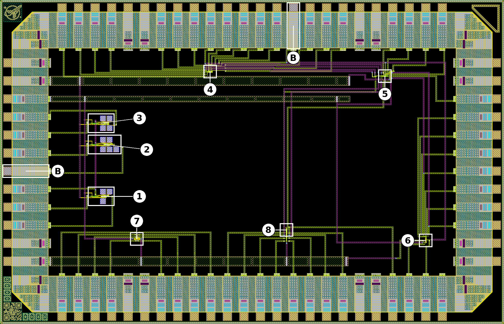
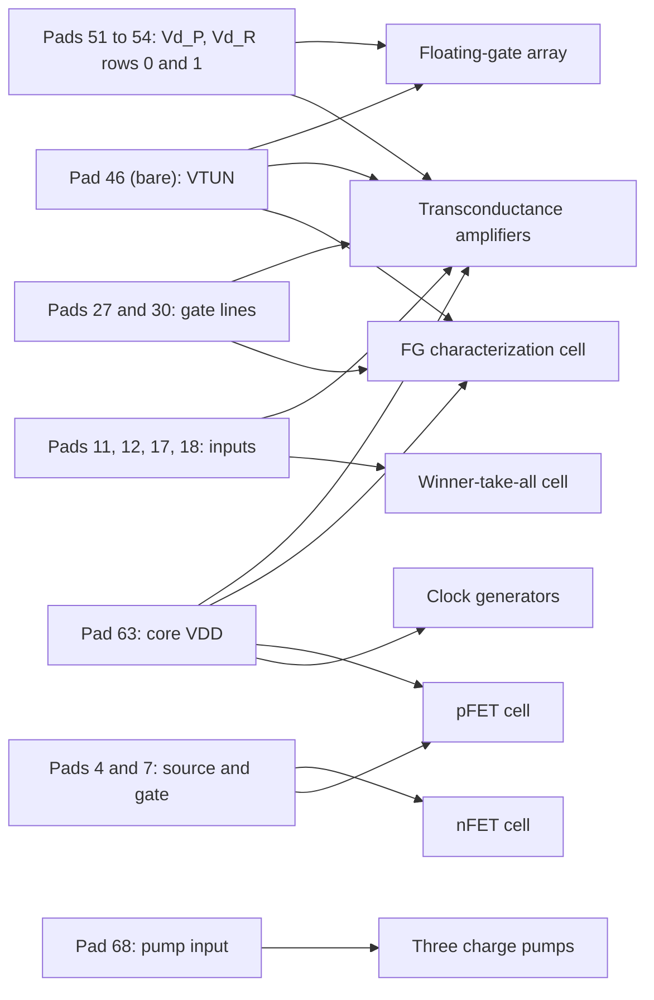
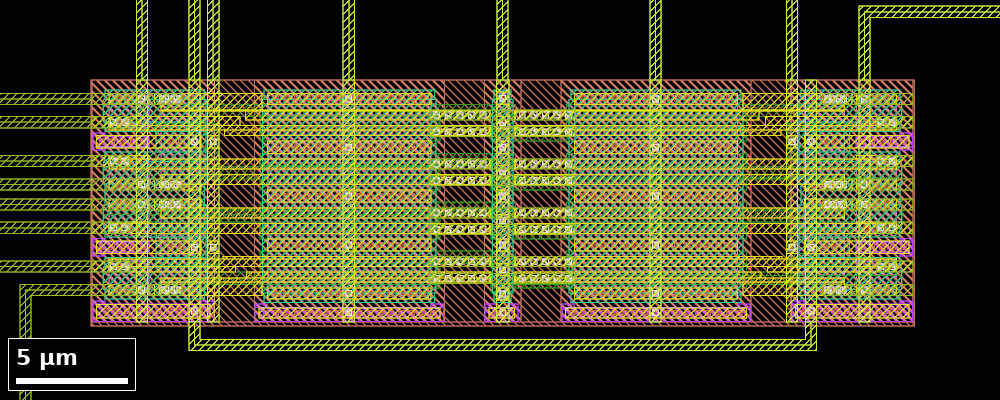
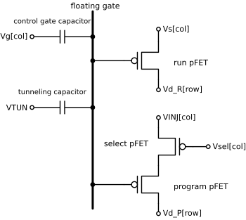
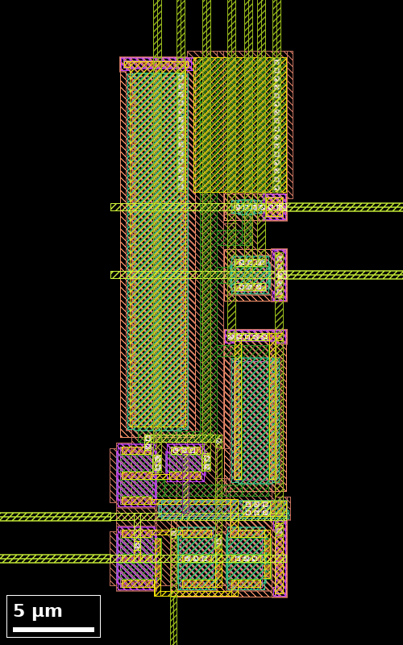
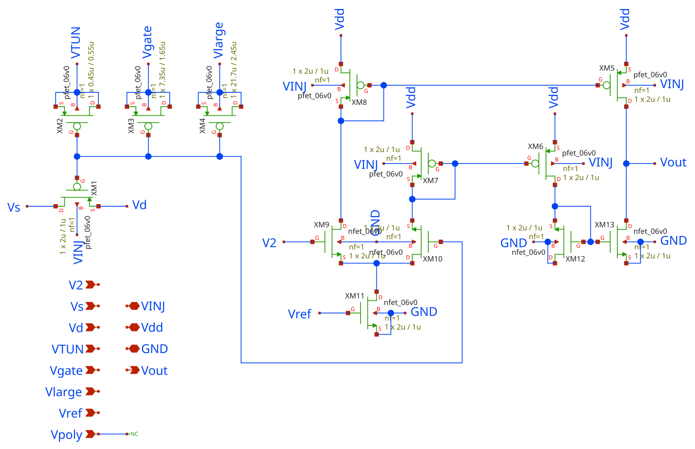
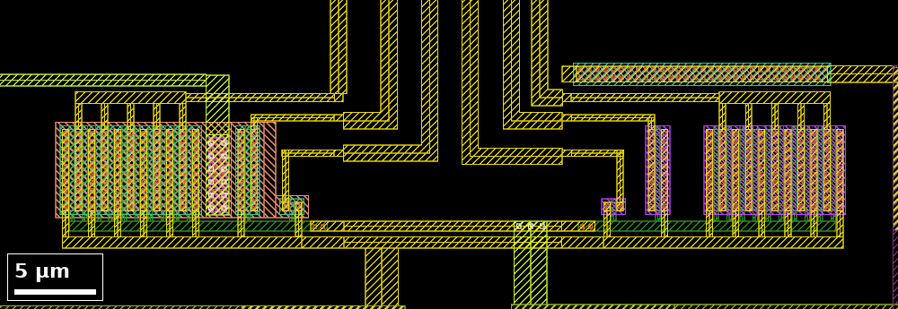
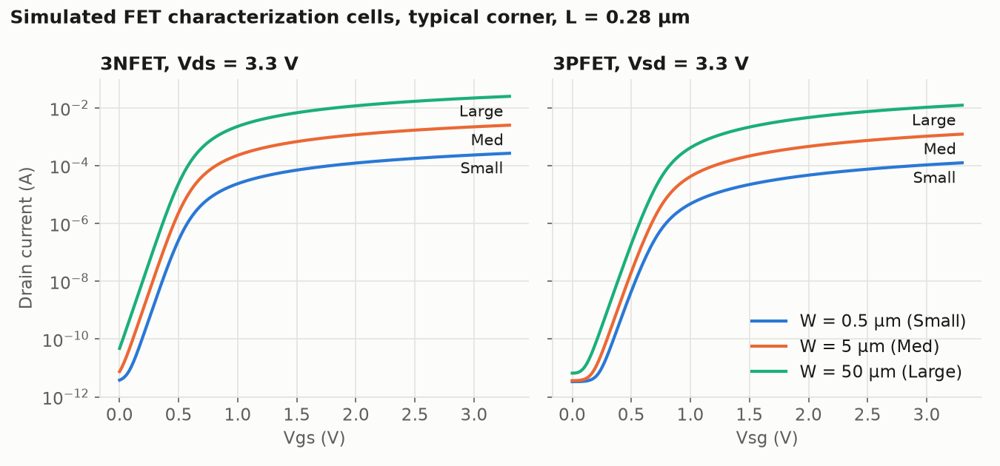
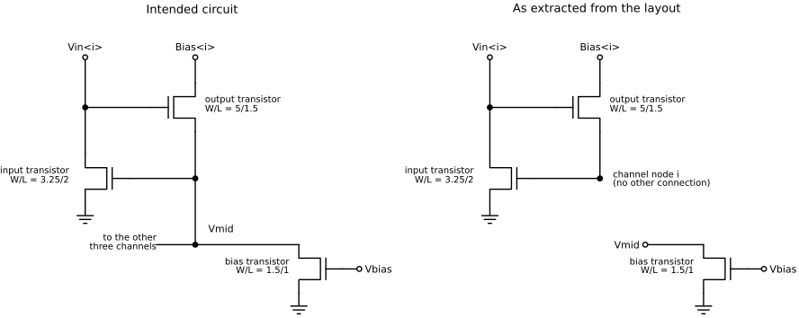
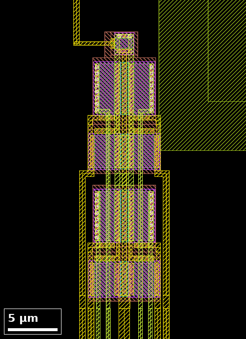

# ASHES-GF180nm: ICE Lab test chip

This repository contains analog and floating-gate (FG) standard cells for the
open [GlobalFoundries](https://gf.com/) GF180MCU process and the first test chip
fabricated with them. It is maintained by the
[Integrated Computational Electronics (ICE) Laboratory](https://hasler.ece.gatech.edu/)
at the [Georgia Institute of Technology](https://www.gatech.edu/), led by
Jennifer Hasler. The commit history lists Luke Hanks as author.

A floating-gate transistor stores charge on an electrically isolated gate. The
charge sets a non-volatile analog parameter that can be changed after
fabrication by hot-electron injection and Fowler-Nordheim tunneling. The ICE
Laboratory has used such devices in programmable analog standard cell libraries
in 130 nm CMOS
([Hasler et al., 2024](https://doi.org/10.1109/TCSI.2024.3355070)) and 65 nm
CMOS ([Mathews et al., 2024](https://doi.org/10.1109/TVLSI.2024.3432916)), and
has demonstrated a floating-gate pFET in a 16 nm FinFET process
([Ayyappan et al., 2025](https://doi.org/10.1109/ESSERC66193.2025.11214091)).
The repository includes a cell library for the laboratory's
[ASHES](https://github.com/GTIceLab/ashes) synthesis tool
([Ige et al., 2023](https://doi.org/10.3390/jlpea13040058)), which assembles
analog systems from standard cells.

Porting a floating-gate library to a new process requires three sets of
process-specific measurements, and each [test structure](#test-structures)
supplies one of them:

| Measurement | Test structures |
|---|---|
| Injection and tunneling rates as functions of the terminal voltages, and the capacitive coupling onto the floating gate | [Floating-gate characterization cell](#floating-gate-characterization-cell), [floating-gate array](#floating-gate-array) |
| The programming voltages that on-chip charge pumps can generate | [Charge pumps](#charge-pumps) |
| The agreement of the MOSFETs with the PDK models | [FET characterization cells](#fet-characterization-cells) |

Two circuit cells, the
[transconductance amplifiers](#transconductance-amplifiers) and the
[winner-take-all cell](#winner-take-all-cell), test complete library cells.
A search of Crossref and the web in October 2026 found no published
floating-gate measurements for GF180MCU.

## Status

| Item | State |
|---|---|
| Shuttle | [wafer.space](https://wafer.space/) GF180MCU Run 2, shuttle ID G802 |
| Project | `0000`, "ICELab Test Chip", in the [ws-run2 project list](https://github.com/wafer-space/ws-run2) |
| Layout | Final layout committed on 15 July 2026 |
| Silicon | Expected in November 2026 |
| Measurements | None yet. All expected values in this repository are simulated. |

### Known layout issues

Netlist extraction of the final layout shows two connections that differ from
the intended circuits. Neither has been confirmed by the designers.

| Structure | Finding | Details |
|---|---|---|
| [Transconductance amplifiers](#transconductance-amplifiers) | `VINJ` does not reach a pad, and pad 24 is unconnected. | [OTA&nbsp;README](1_Design/GF180_cells/2TA/README.md#known-layout-issues) |
| [Winner-take-all cell](#winner-take-all-cell) | The common node `Vmid` does not connect to the four channels. | [WTA&nbsp;README](2_Tools/lib/gds/README.md#known-layout-issues) |

## Chip overview



*Figure 1. Chip layout before metal fill, 3932 µm × 2531 µm. The numbers
correspond to the table of [test structures](#test-structures). `B` marks the
two bare pads.*

| Property | Value |
|---|---|
| Process | [GF180MCU](https://gf180mcu-pdk.readthedocs.io/), `gf180mcuD` variant of the [open PDK](https://github.com/wafer-space/gf180mcu) |
| Slot | `1x0p5` |
| Die size | 3932&nbsp;µm&nbsp;×&nbsp;2531&nbsp;µm |
| Top cell | `chip_top` |
| Pads | 72: 54 analog, 2 bare, 8 ground (`dvss`), 8 pad ring supply (`dvdd`) |
| Layout before metal fill | [`chip_top_prefill.gds`](1_Design/Tapeouts/WaferSpaceShuttleRun2/TrueFinalGds/chip_top_prefill.gds) |
| Layout with metal fill | [`chip_top.gds`](1_Design/Tapeouts/WaferSpaceShuttleRun2/TrueFinalGds/chip_top.gds) |

### Pad map


*Figure 2. Pad map. Pad 1 is at the lower left and the numbers run
counterclockwise. The pad tables and the electrical constraints are in
[`docs/pad-map.md`](docs/pad-map.md).*

### Shared pads

Several pads serve more than one test structure. The charge pump outputs
connect only to pads: no pump is wired to a floating-gate structure on the
chip, so a programming voltage reaches `VTUN` or `VINJ` only through an
external connection.



## Test structures

| # | Structure | Layout cell | Size (µm) | Origin (µm) | Full details |
|---|---|---|---|---|---|
| 1 | [Injection charge pump](#charge-pumps)[^1] | `InjectionSchottkyPump` | 95.8&nbsp;×&nbsp;118.5 | 780,&nbsp;938 | [FinalPumps&nbsp;README](2_Tools/lib/gds/FinalPumps/README.md), [design&nbsp;files&nbsp;README](1_Design/GF180_cells/InjectionSchottyPump/README.md) |
| 2 | [HV charge pump](#charge-pumps)[^2] | `HVSchottkyPump` | 150.0&nbsp;×&nbsp;118.5 | 780,&nbsp;1343 | [FinalPumps&nbsp;README](2_Tools/lib/gds/FinalPumps/README.md) |
| 3 | [Tunneling charge pump](#charge-pumps)[^3] | `TunnelingSchottkyPump` | 95.8&nbsp;×&nbsp;118.5 | 780,&nbsp;1509 | [FinalPumps&nbsp;README](2_Tools/lib/gds/FinalPumps/README.md) |
| 4 | [Floating-gate array](#floating-gate-array)[^4] | `gf180_4x2_Indirect` | 37.0&nbsp;×&nbsp;11.1 | 1621,&nbsp;1966 | [FG&nbsp;array&nbsp;README](1_Design/GF180_cells/4x2_Indirect/README.md) |
| 5 | [Transconductance amplifiers](#transconductance-amplifiers)[^5] | `gf180_2TA_1FG_Strong` | 39.1&nbsp;×&nbsp;12.0 | 2984,&nbsp;1931 | [OTA&nbsp;README](1_Design/GF180_cells/2TA/README.md) |
| 6 | [Floating-gate characterization cell](#floating-gate-characterization-cell)[^6] | `gf180_FG_Characterization` | 11.3&nbsp;×&nbsp;33.9 | 3316,&nbsp;635 | [FG&nbsp;characterization&nbsp;README](1_Design/GF180_cells/FGCharacterization/README.md) |
| 7 | [FET characterization cells](#fet-characterization-cells)[^7] | `3PFET`<br/>`3NFET` | 17.7&nbsp;×&nbsp;10.6<br/>17.4&nbsp;×&nbsp;11.4 | 1043,&nbsp;659<br/>1074,&nbsp;659 | [FET&nbsp;characterization&nbsp;README](1_Design/GF180_cells/Ike/README.md) |
| 8 | [Winner-take-all cell](#winner-take-all-cell)[^8] | `WTA` | 9.6&nbsp;×&nbsp;28.2 | 2229,&nbsp;721 | [WTA&nbsp;README](2_Tools/lib/gds/README.md) |

Size is the bounding box of the cell as placed in `chip_top`, and origin is its
lower-left corner.

### Related documents

| Document | Contents |
|---|---|
| [`docs/pad-map.md`](docs/pad-map.md) | Every pad, the port it connects to, and the electrical constraints of the pad ring. |
| [`docs/sim/README.md`](docs/sim/README.md) | Testbenches, simulation conditions and the full result tables. |
| [`docs/netlists/`](docs/netlists) | Netlists extracted from the layouts. |
| [`docs/references.md`](docs/references.md) | Reference list for every structure, with open-access copies where available. |
| [`docs/repository.md`](docs/repository.md) | Directory guide, chip-level GDS files, layout viewing and design flow. |
| [`docs/updating-images.md`](docs/updating-images.md) | Procedure for regenerating the figures. |
| [Clock&nbsp;generator&nbsp;README](1_Design/GF180_cells/NonOvCLKGen/README.md) | The non-overlapping clock generator used by each charge pump. |

## Charge pumps

The chip carries three Dickson charge pumps
([Dickson, 1976](https://doi.org/10.1109/JSSC.1976.1050739)) built from
Schottky diodes and 3.2 pF MIM capacitors. A charge pump generates a voltage
above the supply from a two-phase clock, which floating-gate circuits require
for hot-electron injection and Fowler-Nordheim tunneling. The pumps are named
injection, HV (high voltage) and tunneling, and have two, four and three
stages. The repository does not record the intended use of the HV pump. Each
pump is driven by its own non-overlapping clock generator.

<table>
  <tr>
    <td width="33%"><br/><em>1. Injection pump, two stages</em></td>
    <td width="33%"><br/><em>2. HV pump, four stages</em></td>
    <td width="33%"><br/><em>3. Tunneling pump, three stages</em></td>
  </tr>
</table>

*Figure 3. Layouts of the three charge pumps. In each, the clock generator is
the small block at the left and the squares are the MIM capacitors.*


*Figure 4. Circuit of the pumps. N is 2 for the injection pump, 4 for the HV
pump and 3 for the tunneling pump.*

### Pad assignment

All three pumps take their input from pad 68, their clock generator supply from
pad 63 and ground from the `dvss` pads. Each has its own clock pad and output
pad. See the
[FinalPumps&nbsp;README](2_Tools/lib/gds/FinalPumps/README.md#pad-assignment).

### Measurement and expected results

A square-wave clock is applied to the clock pad of one pump and its output is
measured with a high-impedance instrument. The table gives the simulated
unloaded output with the input voltage and the clock amplitude equal to `VDD`,
at a clock frequency of 10 MHz.

| Pump | Clock pad | Output pad | Output at `VDD` = 3.3 V | Output at `VDD` = 5 V |
|---|---|---|---|---|
| Injection | 69 | 70 | 9.2 V | 14.2 V |
| HV | 66 | 67 (bare) | 15.2 V | 23.6 V |
| Tunneling | 65 | 64 | 12.2 V | 18.9 V |

These values are upper bounds, not predictions:

- The MIM capacitor model has no breakdown and its model file states a 6 V
  rating. The `sc_diode` model has a 17 V reverse breakdown.
- The analog pads on the injection and tunneling pump outputs clamp at the pad
  ring supply plus a diode drop
  ([electrical constraints](docs/pad-map.md#electrical-constraints)).
- A 10 MΩ load lowers the output by 0.2 V to 0.5 V at 10 MHz and by up to
  2.6 V at 1 MHz.


*Figure 5. Simulated start-up at `VDD` = 5 V with a 10 MHz clock and no load
current.*

The measurement procedure and the full results are in the
[FinalPumps&nbsp;README](2_Tools/lib/gds/FinalPumps/README.md).

### Key references

- M. Hooper, M. Kucic, P. Hasler, "Integration of High Voltage Charge-Pumps in
  a Submicron Standard CMOS Process for Programming Analog Floating-Gate
  Circuits," IEEE ISCAS 2005.
  [doi:10.1109/ISCAS.2005.1464540](https://doi.org/10.1109/ISCAS.2005.1464540)
- J. F. Dickson, "On-chip high-voltage generation in MNOS integrated circuits
  using an improved voltage multiplier technique," IEEE Journal of Solid-State
  Circuits, 1976.
  [doi:10.1109/JSSC.1976.1050739](https://doi.org/10.1109/JSSC.1976.1050739)
- [Full list](docs/references.md#charge-pumps)

## Floating-gate array

`gf180_4x2_Indirect` is a 4×2 array of indirectly programmed floating-gate
pFETs. Each cell has one floating gate shared by two pFETs: the program pFET
is used only to program the gate by injection, and the run pFET carries the
signal current. The signal path is therefore never disconnected for programming
([Graham et al., 2007](https://doi.org/10.1109/TCSI.2007.895521)).



*Figure 6. Layout of the floating-gate array.*



*Figure 7. One cell of the array.*

### Pad assignment

The array uses pads 43 to 60 on the top side. `VTUN` is on bare pad 46, and
both `VINJ` columns share pad 49. See the
[FG&nbsp;array&nbsp;README](1_Design/GF180_cells/4x2_Indirect/README.md#pad-assignment).

### Measurement and expected results

Each cell is read by sweeping its gate line and measuring the current of the
run pFET; the curve shifts after tunneling or injection. No expected values
are recorded: programming voltages and rates in GF180MCU are among the
quantities the chip is intended to measure.

### Key references

- D. W. Graham, E. Farquhar, B. Degnan, C. Gordon, P. Hasler, "Indirect
  Programming of Floating-Gate Transistors," IEEE Trans. Circuits and Systems
  I, 2007.
  [doi:10.1109/TCSI.2007.895521](https://doi.org/10.1109/TCSI.2007.895521)
- [Full list](docs/references.md#indirectly-programmed-floating-gate-array)

## Transconductance amplifiers

`gf180_2TA_1FG_Strong` contains two operational transconductance amplifiers
(OTAs) with floating-gate programming. An OTA converts a differential input
voltage into an output current. A `PROG` pad switches the cell between
programming and normal operation.


*Figure 8. Layout of the two amplifiers.*


*Figure 9. Schematic of the two amplifiers.*

### Pad assignment

The inputs are on pads 11, 12, 17 and 18, shared with the
[winner-take-all cell](#winner-take-all-cell). The outputs are on pads 34 and
37 and `PROG` is on pad 38. The programming lines are shared with the
[floating-gate array](#floating-gate-array). `VINJ` does not reach a pad
([known layout issues](#known-layout-issues)). See the
[OTA&nbsp;README](1_Design/GF180_cells/2TA/README.md#pad-assignment).

### Measurement and expected results

The transfer characteristic is measured by sweeping the differential input,
before and after programming the floating gates. No expected values are
recorded.

### Key references

- R. Chawla, F. Adil, G. Serrano, P. E. Hasler, "Programmable Gm-C Filters
  Using Floating-Gate Operational Transconductance Amplifiers," IEEE Trans.
  Circuits and Systems I, 2007.
  [doi:10.1109/TCSI.2006.887473](https://doi.org/10.1109/TCSI.2006.887473)
- [Full list](docs/references.md#floating-gate-transconductance-amplifiers)

## Floating-gate characterization cell

`gf180_FG_Characterization` is a single floating-gate pFET with its source,
drain and well, a tunneling capacitor and two coupling capacitors of different
size on separate pads. A differential amplifier compares the floating-gate
voltage with an external reference, so that the gate voltage can be observed.

<table>
  <tr>
    <td width="25%" align="center"></td>
    <td></td>
  </tr>
</table>

*Figure 10. Layout (left) and schematic (right) of the floating-gate
characterization cell.*

### Pad assignment

The cell uses pads 22, 23 and 27 to 33, with `VTUN` on bare pad 46. See the
[FG&nbsp;characterization&nbsp;README](1_Design/GF180_cells/FGCharacterization/README.md#pad-assignment).

### Measurement and expected results

The pFET current is measured against the voltage on each coupling capacitor,
and the floating-gate voltage is read through the amplifier, before and after
tunneling and injection pulses. No expected values are recorded; these
measurements are the purpose of the cell.

### Key references

- P. Hasler, A. Basu, S. Koziol, "Above Threshold pFET Injection Modeling
  intended for Programming Floating-Gate Systems," IEEE ISCAS 2007.
  [doi:10.1109/ISCAS.2007.378709](https://doi.org/10.1109/ISCAS.2007.378709)
- M. Lenzlinger, E. H. Snow, "Fowler-Nordheim Tunneling into Thermally Grown
  SiO2," Journal of Applied Physics, 1969.
  [doi:10.1063/1.1657043](https://doi.org/10.1063/1.1657043)
- [Full list](docs/references.md#floating-gate-characterization)

## FET characterization cells

`3NFET` and `3PFET` each contain three standalone MOSFETs for comparison with
the PDK models. All six are 3.3 V devices with a gate length of 0.28 µm and
widths of 0.5 µm, 5 µm and 50 µm.



*Figure 11. Layout of the pFET cell (left) and the nFET cell (right).*

### Pad assignment

The cells use pads 1 to 4 and 7 to 10 on the bottom side. All six transistors
share one gate pad and one source pad, and each has its own drain pad. See the
[FET&nbsp;characterization&nbsp;README](1_Design/GF180_cells/Ike/README.md#pad-assignment).

### Measurement and expected results

The gate and the drain are swept with a source-measure unit. No terminal pair
may exceed 3.3 V. With 3.3 V on the gate and the drain, the typical models give
the currents below.

| Width | nFET | pFET |
|---|---|---|
| 0.5 µm | 0.27 mA | 0.13 mA |
| 5 µm | 2.5 mA | 1.2 mA |
| 50 µm | 25 mA | 12.5 mA |



*Figure 12. Simulated drain current against gate voltage at a drain bias of
3.3 V.*

### Key references

- C. C. Enz, F. Krummenacher, E. A. Vittoz, "An analytical MOS transistor model
  valid in all regions of operation and dedicated to low-voltage and
  low-current applications," Analog Integrated Circuits and Signal Processing,
  1995. [doi:10.1007/BF01239381](https://doi.org/10.1007/BF01239381)
- [Full list](docs/references.md#fet-characterization)

## Winner-take-all cell

`WTA` is a four-input winner-take-all circuit with nine nFETs, after
[Lazzaro et al. (1988)](https://papers.nips.cc/paper/1988/file/a8f15eda80c50adb0e71943adc8015cf-Paper.pdf).
In that circuit the channel with the largest input current takes the whole of a
shared bias current.



*Figure 13. One channel and the bias transistor: the intended circuit (left)
and the circuit extracted from the layout (right).*



*Figure 14. Layout of the winner-take-all cell.*

### Pad assignment

The inputs are on pads 11, 12, 17 and 18, shared with the
[transconductance amplifiers](#transconductance-amplifiers). The outputs are on
pads 13 to 16 and the bias is on pad 21. See the
[WTA&nbsp;README](2_Tools/lib/gds/README.md#pad-assignment).

### Measurement and expected results

A current is sourced into each input and the output currents are measured. In
the extracted layout the common node does not connect to the four channels
([known layout issues](#known-layout-issues)), so winner-take-all behavior is
not expected. No expected values are recorded.

### Key references

- S. Ramakrishnan, J. Hasler, "Vector-Matrix Multiply and Winner-Take-All as an
  Analog Classifier," IEEE Trans. VLSI Systems, 2014.
  [doi:10.1109/TVLSI.2013.2245351](https://doi.org/10.1109/TVLSI.2013.2245351)
- J. Lazzaro, S. Ryckebusch, M. A. Mahowald, C. A. Mead, "Winner-Take-All
  Networks of O(N) Complexity," Advances in Neural Information Processing
  Systems 1, 1988.
  [PDF](https://papers.nips.cc/paper/1988/file/a8f15eda80c50adb0e71943adc8015cf-Paper.pdf)
- [Full list](docs/references.md#winner-take-all)

## License

This repository is licensed under the
[Apache License, Version 2.0](https://www.apache.org/licenses/LICENSE-2.0). See
[`LICENSE`](LICENSE).

## Citing

No publication describes this chip yet. The repository can be cited as:

```bibtex
@misc{ashes_gf180nm,
  author       = {{Georgia Tech Integrated Computational Electronics Laboratory}},
  title        = {{ASHES-GF180nm}: {ICE} {Lab} test chip and analog standard cells for {GF180MCU}},
  year         = {2026},
  howpublished = {\url{https://github.com/GTIceLab/ASHES-GF180nm}},
  note         = {wafer.space GF180MCU Run 2, project 0000}
}
```

The ASHES tool and the standard cell approach are described in:

- A. Ige, L. Yang, H. Yang, J. Hasler, C. Hao, "Analog System High-Level
  Synthesis for Energy-Efficient Reconfigurable Computing," Journal of Low
  Power Electronics and Applications, vol. 13, no. 4, art. 58, 2023.
  [doi:10.3390/jlpea13040058](https://doi.org/10.3390/jlpea13040058) (open
  access)
- J. Hasler, P. R. Ayyappan, A. Ige, P. Mathews, "A 130nm CMOS Programmable
  Analog Standard Cell Library," IEEE Trans. Circuits and Systems I, vol. 71,
  no. 6, pp. 2497-2510, 2024.
  [doi:10.1109/TCSI.2024.3355070](https://doi.org/10.1109/TCSI.2024.3355070)
- [Full list](docs/references.md#programmable-analog-standard-cells-and-ashes)

## Acknowledgements

- [wafer.space](https://wafer.space/) provided the GF180MCU Run 2 shuttle.
- [GlobalFoundries](https://gf.com/) and [Google](https://opensource.google/)
  released the open [GF180MCU PDK](https://github.com/google/gf180mcu-pdk).
- The design uses the open-source tools
  [xschem](https://xschem.sourceforge.io/),
  [ngspice](https://ngspice.sourceforge.io/),
  [Magic](http://opencircuitdesign.com/magic/) and
  [KLayout](https://www.klayout.de/).

[^1]: Marked 1 in Figure 1. Two-stage Dickson charge pump with Schottky diodes.
[^2]: Marked 2 in Figure 1. Four-stage pump. Its output is on a bare pad.
[^3]: Marked 3 in Figure 1. Three-stage pump.
[^4]: Marked 4 in Figure 1. 4×2 array of indirectly programmed floating-gate pFETs.
[^5]: Marked 5 in Figure 1. Two floating-gate OTAs.
[^6]: Marked 6 in Figure 1. One floating-gate pFET with every terminal on a pad.
[^7]: Marked 7 in Figure 1. The pFET cell is on the left and the nFET cell on the right.
[^8]: Marked 8 in Figure 1. Four-input winner-take-all cell.
