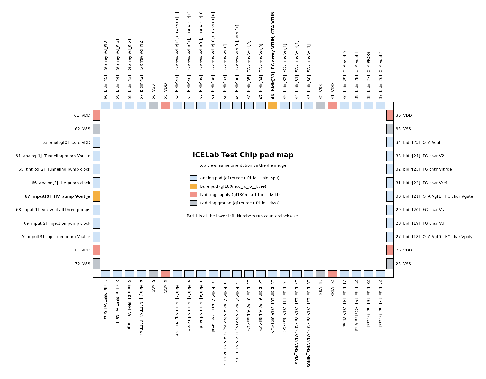

# Pad map

The pad ring fills a wafer.space `1x0p5` slot. Pad numbers start at the
lower-left corner and run counterclockwise. The pad labels in the GDS keep the
names from the wafer.space project template, such as `clk_PAD` and
`bidir_PAD[0]`.

| Pad cell | Count | Use on this chip |
|---|---|---|
| `gf180mcu_fd_io__asig_5p0` | 54 | Analog signal pads. |
| `gf180mcu_fd_io__bare` | 2 | Pads 46 and 67, for the two high-voltage nets. The extracted cell contains no devices. |
| `gf180mcu_fd_io__dvss` | 8 | Ground for the pad ring and for the `GND` port of every test structure. |
| `gf180mcu_fd_io__dvdd` | 8 | Pad ring supply. No test structure connects to these pads. |

The map comes from a netlist extracted from
[`chip_top_prefill.gds`](../1_Design/Tapeouts/WaferSpaceShuttleRun2/TrueFinalGds/chip_top_prefill.gds)
with the GF180MCU KLayout LVS deck. It has not been checked against silicon.

## Electrical constraints

| Topic | Detail |
|---|---|
| Ground | Every cell `GND` port is on one net, a ring along the inside edge of the pad ring. The extraction names this net `VSS` after the `dvss` pad labels (pads 5, 19, 25, 35, 42, 56, 62 and 72). |
| Core supply | Pad 63 (`analog_PAD[0]`) carries `VDD` for the clock generators, the clock buffers, the OTA, the FG char cell and the PFET cell. The `dvdd` pads do not feed the core. |
| Pad ring supply | The `dvdd` pads (6, 20, 26, 36, 41, 55, 61, 71) supply the pad ring only. |
| Pad voltage limits | In the PDK netlist of `gf180mcu_fd_io__asig_5p0`, a `diode_pd2nw_06v0` connects the pad (anode) to `DVDD` (cathode) and a `diode_nd2ps_06v0` connects `DVSS` to the pad. An analog pad therefore clamps at the pad ring supply plus a diode drop, and at a diode drop below ground. This limits the injection and tunneling pump outputs (pads 70 and 64) and the `VINJ` pads (23 and 49). The bare pads have no such diodes. |
| Bare pads | Pad 46 carries `VTUN` for the FG array, the OTA and the FG char cell. Pad 67 carries the HV pump output. |
| Shared pads | The WTA inputs share pads 11, 12, 17 and 18 with the OTA inputs. The OTA shares pads 27 and 30 with the FG char cell, and pads 51 to 54 with the FG array. |
| Pump clocks | Each pump clock pad drives an `inv_1` and an `inv_4` standard cell in series, then the `CLK_IN` of that pump's clock generator. |
| OTA `RUN` | Driven from pad 38 (`PROG`) through an `inv_4` cell, so `RUN` is the inverse of `PROG`. |
| OTA `VINJ` | Not connected to any pad. See the [OTA&nbsp;README](../1_Design/GF180_cells/2TA/README.md#known-layout-issues). |
| Pad 24 | Not connected to any test structure. |
| Internal nodes | The injection pump `Stage1_out` and `Stage2_out` nodes and the WTA `Vmid` node do not reach a pad. |

## Bottom side, left to right

| Pad | Label in GDS | Pad cell | Connects to |
|---|---|---|---|
| 1 | `clk_PAD` | Analog | PFET `Vd_Small` |
| 2 | `rst_n_PAD` | Analog | PFET `Vd_Med` |
| 3 | `bidir_PAD[0]` | Analog | PFET `Vd_Large` |
| 4 | `bidir_PAD[1]` | Analog | NFET `Vs`, PFET `Vs` |
| 5 | `VSS` | Ground | Ground: `GND` of every cell |
| 6 | `VDD` | Supply | Pad ring supply only |
| 7 | `bidir_PAD[2]` | Analog | NFET `Vg`, PFET `Vg` |
| 8 | `bidir_PAD[3]` | Analog | NFET `Vd_Large` |
| 9 | `bidir_PAD[4]` | Analog | NFET `Vd_Med` |
| 10 | `bidir_PAD[5]` | Analog | NFET `Vd_Small` |
| 11 | `bidir_PAD[6]` | Analog | WTA `Vin<0>`, OTA `VIN1_MINUS` |
| 12 | `bidir_PAD[7]` | Analog | WTA `Vin<1>`, OTA `VIN1_PLUS` |
| 13 | `bidir_PAD[8]` | Analog | WTA `Bias<1>` |
| 14 | `bidir_PAD[9]` | Analog | WTA `Bias<0>` |
| 15 | `bidir_PAD[10]` | Analog | WTA `Bias<3>` |
| 16 | `bidir_PAD[11]` | Analog | WTA `Bias<2>` |
| 17 | `bidir_PAD[12]` | Analog | WTA `Vin<2>`, OTA `VIN2_PLUS` |
| 18 | `bidir_PAD[13]` | Analog | WTA `Vin<3>`, OTA `VIN2_MINUS` |
| 19 | `VSS` | Ground | Ground: `GND` of every cell |
| 20 | `VDD` | Supply | Pad ring supply only |
| 21 | `bidir_PAD[14]` | Analog | WTA `Vbias` |
| 22 | `bidir_PAD[15]` | Analog | FG char `Vout` |
| 23 | `bidir_PAD[16]` | Analog | FG char `VINJ` |
| 24 | `bidir_PAD[17]` | Analog | Not connected |

## Right side, bottom to top

| Pad | Label in GDS | Pad cell | Connects to |
|---|---|---|---|
| 25 | `VSS` | Ground | Ground: `GND` of every cell |
| 26 | `VDD` | Supply | Pad ring supply only |
| 27 | `bidir_PAD[18]` | Analog | OTA `Vg[0]`, FG char `Vpoly` |
| 28 | `bidir_PAD[19]` | Analog | FG char `Vd` |
| 29 | `bidir_PAD[20]` | Analog | FG char `Vs` |
| 30 | `bidir_PAD[21]` | Analog | OTA `Vg[1]`, FG char `Vgate` |
| 31 | `bidir_PAD[22]` | Analog | FG char `Vref` |
| 32 | `bidir_PAD[23]` | Analog | FG char `Vlarge` |
| 33 | `bidir_PAD[24]` | Analog | FG char `V2` |
| 34 | `bidir_PAD[25]` | Analog | OTA `Vout1` |
| 35 | `VSS` | Ground | Ground: `GND` of every cell |
| 36 | `VDD` | Supply | Pad ring supply only |

## Top side, right to left

| Pad | Label in GDS | Pad cell | Connects to |
|---|---|---|---|
| 37 | `bidir_PAD[26]` | Analog | OTA `Vout2` |
| 38 | `bidir_PAD[27]` | Analog | OTA `PROG` |
| 39 | `bidir_PAD[28]` | Analog | OTA `Vsel[1]` |
| 40 | `bidir_PAD[29]` | Analog | OTA `Vsel[0]` |
| 41 | `VDD` | Supply | Pad ring supply only |
| 42 | `VSS` | Ground | Ground: `GND` of every cell |
| 43 | `bidir_PAD[30]` | Analog | FG array `Vs[1]` |
| 44 | `bidir_PAD[31]` | Analog | FG array `Vsel[1]` |
| 45 | `bidir_PAD[32]` | Analog | FG array `Vg[1]` |
| 46 | `bidir_PAD[33]` | Bare | `VTUN` of the FG array, the OTA and the FG char cell |
| 47 | `bidir_PAD[34]` | Analog | FG array `Vg[0]` |
| 48 | `bidir_PAD[35]` | Analog | FG array `Vsel[0]` |
| 49 | `bidir_PAD[36]` | Analog | FG array `VINJ[0]`, `VINJ[1]` |
| 50 | `bidir_PAD[37]` | Analog | FG array `Vs[0]` |
| 51 | `bidir_PAD[38]` | Analog | FG array `Vd_P[0]`, OTA `VD_P[0]` |
| 52 | `bidir_PAD[39]` | Analog | FG array `Vd_R[0]`, OTA `VD_R[0]` |
| 53 | `bidir_PAD[40]` | Analog | FG array `Vd_R[1]`, OTA `VD_R[1]` |
| 54 | `bidir_PAD[41]` | Analog | FG array `Vd_P[1]`, OTA `VD_P[1]` |
| 55 | `VDD` | Supply | Pad ring supply only |
| 56 | `VSS` | Ground | Ground: `GND` of every cell |
| 57 | `bidir_PAD[42]` | Analog | FG array `Vd_P[2]` |
| 58 | `bidir_PAD[43]` | Analog | FG array `Vd_R[2]` |
| 59 | `bidir_PAD[44]` | Analog | FG array `Vd_R[3]` |
| 60 | `bidir_PAD[45]` | Analog | FG array `Vd_P[3]` |

## Left side, top to bottom

| Pad | Label in GDS | Pad cell | Connects to |
|---|---|---|---|
| 61 | `VDD` | Supply | Pad ring supply only |
| 62 | `VSS` | Ground | Ground: `GND` of every cell |
| 63 | `analog_PAD[0]` | Analog | Core `VDD` |
| 64 | `analog_PAD[1]` | Analog | Tunneling pump `Vout_e` |
| 65 | `analog_PAD[2]` | Analog | Tunneling pump clock |
| 66 | `analog_PAD[3]` | Analog | HV pump clock |
| 67 | `input_PAD[0]` | Bare | HV pump `Vout_e` |
| 68 | `input_PAD[1]` | Analog | `Vin_w` of all three pumps |
| 69 | `input_PAD[2]` | Analog | Injection pump clock |
| 70 | `input_PAD[3]` | Analog | Injection pump `Vout_e` |
| 71 | `VDD` | Supply | Pad ring supply only |
| 72 | `VSS` | Ground | Ground: `GND` of every cell |
